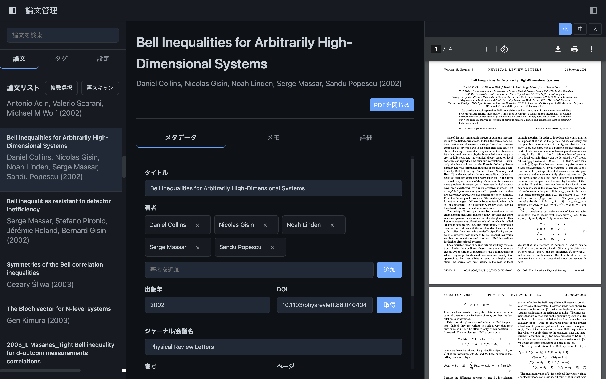

# BibSync - 研究論文管理アプリケーション

BibSyncは、研究者や学生のための論文管理アプリケーションです。論文PDFとそのメタデータ、メモを一元管理し、効率的な研究活動をサポートします。



## 主な機能

### 1. 論文の管理
- 指定したフォルダ（デフォルト: `~/Papers/`）に保存された論文PDFを自動でリストアップ
- 各論文のメタデータ（タイトル、著者、出版年、DOI、タグなど）をJSON形式で管理
- 論文PDFをアプリ内のビューア（PDF.js）または外部ビューアで開く機能
- 論文検索機能による素早いアクセス

### 2. メモ機能
- 各論文ごとにMarkdown形式のメモを作成可能
- 数式（LaTeX）をサポート
- リアルタイムプレビューで直感的な編集
- 自動保存機能搭載

### 3. BibTeX連携
- JSONメタデータをBibTeXに変換し、.bibファイルをエクスポート
- 既存の.bibファイルをインポートし、メタデータと連携
- 複数論文を一括エクスポート可能

### 4. タグ管理
- 各論文にタグを設定し、キーワード（BibTeXのkeywords）と連携
- タグ一覧から論文をフィルタリング可能

### 5. DOI / URLサポート
- DOI / URLをクリックするとブラウザで開く
- CrossRef APIを使用したDOIからのメタデータ自動取得

## インストール方法

### 事前準備
- [Node.js](https://nodejs.org/) (14.x以上)
- [npm](https://www.npmjs.com/) (6.x以上)

### インストール手順

```bash
# リポジトリをクローン
git clone https://github.com/Ryosuke-Nogami/BibSync.git
cd BibSync
# 依存パッケージをインストール
npm install

# アプリケーションを開発モードで起動
npm run dev

# アプリケーションをビルド（配布用）
npm run build
```

## 使用方法

### 初期設定
1. アプリケーション起動後、デフォルトで`~/Papers/`フォルダが論文保存先として設定されます
2. 必要に応じて「設定」タブから論文フォルダとノートフォルダを変更できます
3. ダークモード切り替えも設定から可能です

### 論文の追加と管理
1. PDFファイルを論文フォルダに配置します
2. 「再スキャン」ボタンをクリックして、新しい論文を検出します
3. 論文を選択し、メタデータタブでタイトルや著者などの情報を入力します
4. DOIがある場合は、DOI入力欄に入力して「取得」ボタンをクリックすると自動的にメタデータを取得します
5. 上部の検索ボックスを使用して論文をタイトル、著者、タグなどで検索できます

### BibTeX連携
1. メタデータタブで「BibTeXエディタ」ボタンをクリックします
2. 既存のBibTeXデータを貼り付けるか、「ファイルからインポート」で.bibファイルを読み込みます
3. パースされたエントリを選択し、「メタデータに適用」をクリックすると論文情報が更新されます
4. 詳細タブから「BibTeXをエクスポート」で現在の論文情報を.bibファイルとして出力できます
5. 複数の論文を選択するには「複数選択」ボタンをクリックし、論文を選択後「BibTeXエクスポート」を利用します

### PDF閲覧
1. 「PDFを表示」ボタンをクリックするとPDFビューアが開きます
2. PDFビューアのサイズは上部の「小」「中」「大」ボタンで調節できます
3. 設定で外部PDFビューアを使用するよう設定することも可能です

### メモの作成
1. 論文を選択し、「メモ」タブをクリックします
2. Markdown形式でメモを記入できます（LaTeX形式の数式もサポート）
3. 画面上部のアイコンで分割表示・編集のみ・プレビューのみの表示モードを切り替えられます
4. メモは自動保存されます

### タグの活用
1. メタデータタブでタグを追加・削除できます
2. サイドバーの「タグ」タブからタグをクリックすると、該当する論文だけが表示されます

## システム要件

- **Windows**: Windows 10以降
- **macOS**: macOS 10.13以降
- **Linux**: Ubuntu 18.04以降、または同等のディストリビューション

## プロジェクト構成

```
bibsync/
├── assets/                         # アイコンなどのアセット
├── dist/                           # ビルドされたファイル
├── renderer/                       # フロントエンド（Reactアプリ）
│   ├── components/                 # UIコンポーネント
│   └── styles/                     # CSSスタイル
├── services/                       # バックエンドサービス
├── main.js                         # Electron メインプロセス
├── preload.js                      # プリロードスクリプト
├── package.json                    # プロジェクト設定
└── webpack.config.js               # Webpackの設定
```

## 技術スタック

- **アプリケーションフレームワーク**: [Electron](https://www.electronjs.org/)
- **UI**: [React](https://reactjs.org/)
- **PDFビューア**: [PDF.js](https://mozilla.github.io/pdf.js/)
- **Markdownレンダリング**: [React Markdown](https://github.com/remarkjs/react-markdown)
- **数式サポート**: [KaTeX](https://katex.org/)
- **データベース**: [SQLite](https://www.sqlite.org/) (better-sqlite3)
- **BibTeX解析**: bibtex-parser-js


## ライセンス

[MIT License](LICENSE)

